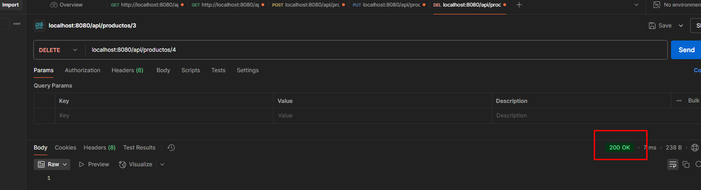
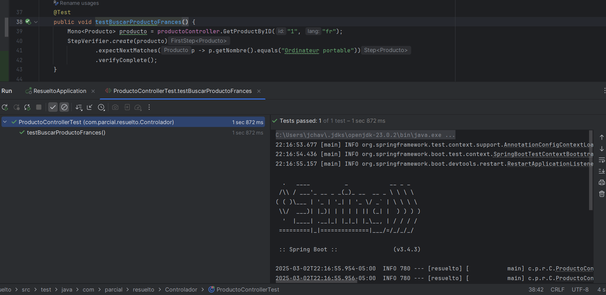

## Instrucciones para ejecutar la aplicación
1. Ingresar al enlace adjunto que lleva al Github donde se encuentra el código, esté se debe descargar.
2. Ingresar a IntelliJ, dar click en "Abrir" y buscar el repositorio.
3. buscar el archivo "FinalApplication" dentro de src/main/java/com/programacion/proyectofinal
4. Dar click derecho en el archivo y seleccionar ejecutar "FinalApplication.Main()"

## Evidencias

* Endpoint para ver mensaje en español:
```
curl --location 'http://localhost:8080/api/saludo' \
--header 'Accept-Language: es'
```


* Endpoint para ver mensaje en inglés:
```
curl --location 'http://localhost:8080/api/saludo' \
--header 'Accept-Language: en' 
```


* Endpoint para ver mensaje en francés:
```
curl --location 'http://localhost:8080/api/saludo' \
--header 'Accept-Language: fr' 
```


* Endpoint para ver todos los productos disponibles en inglés:
```
curl --location 'http://localhost:8080/api/productos?lang=en'
```


* Endpoint para ver todos los productos disponibles en francés:
```
curl --location 'http://localhost:8080/api/productos?lang=fr'
```


* Endpoint para ver todos los productos disponibles en español:
```
curl --location 'http://localhost:8080/api/productos?lang=es'
```


* Endpoint para ver un producto en español:
```
curl --location 'http://localhost:8080/api/productos/1?lang=es'
```


También es posible verlo en inglés y francés de la siguiente forma:
```
curl --location 'http://localhost:8080/api/productos/1?lang=en'
```
```
curl --location 'http://localhost:8080/api/productos/1?lang=fr'
```

*Endpoint para crear un producto:
```
curl --location 'localhost:8080/api/productos' \
--header 'Content-Type: application/json' \
--data '{
"id": "4",
"nombre": "Audifonos Gaming",
"precio": 560.99
}'
```


* Endpoint para modificar un producto:
```
curl --location --request PUT 'localhost:8080/api/productos/4' \
--header 'Content-Type: application/json' \
--data '{
"nombre": "Headphones Gaming",
"precio": 780.99
}'
```


* Endpoint para eliminar un producto:
```
curl --location --request DELETE 'localhost:8080/api/productos/3' \
--data ''
```


## Prueba Unitaria

